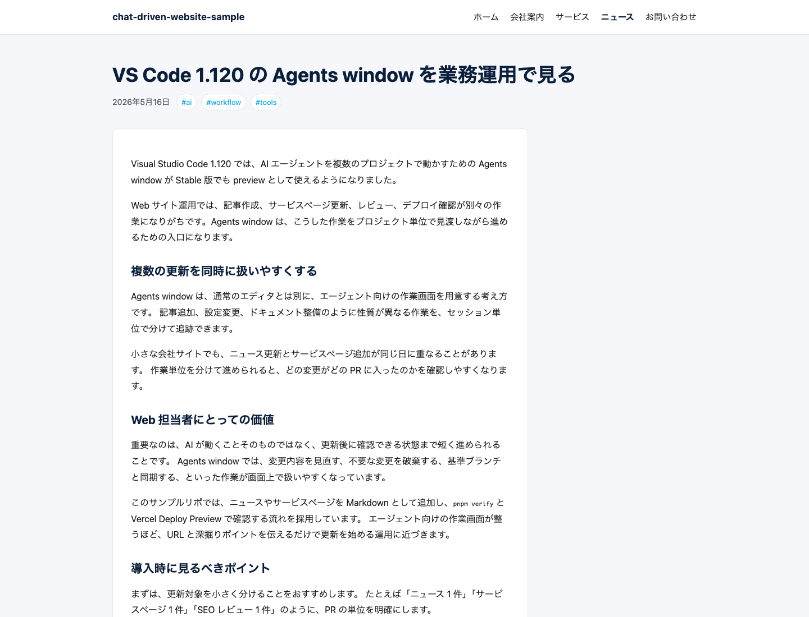
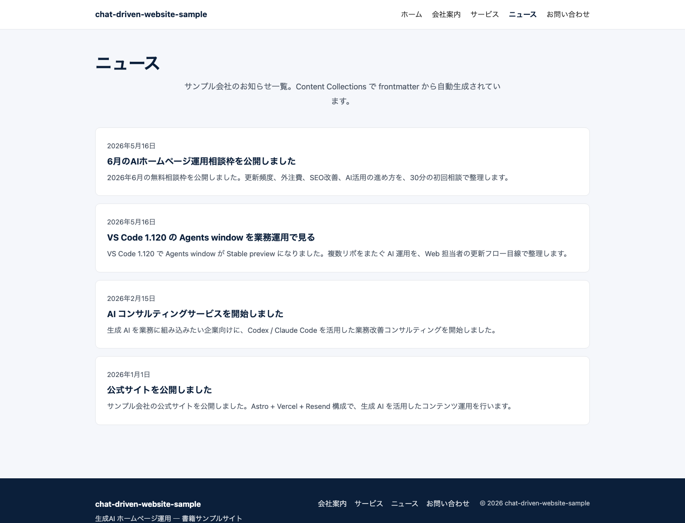
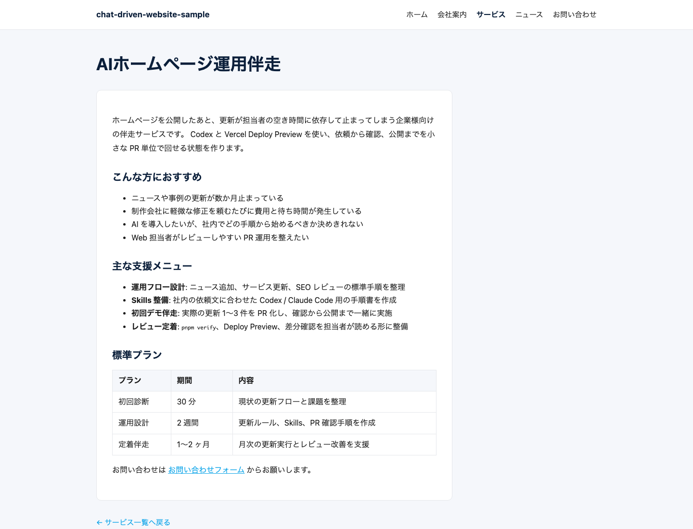

# Phase 1 Demo Day Log

Date: 2026-05-16

This log records the Phase 1 handoff demos for the book chapter "チャットだけで更新する、ある一日".
The goal was to run three realistic website updates through small PRs, verify them locally, merge them, and publish the sample site to Vercel Production.

## Summary

| Demo | Human prompt | PR | Result |
|------|--------------|----|--------|
| Blog article from URL | "この VS Code 1.120 更新をブログ記事化。Web 担当者向けに、複数リポ/複数更新を扱いやすくする点を深掘り。" | [#9](https://github.com/feel-flow/chat-driven-website-sample/pull/9) | `src/content/news/vscode-agents-window.md` added and merged |
| Short news update | "6月のAIホームページ運用相談枠をお知らせとして追加。" | [#10](https://github.com/feel-flow/chat-driven-website-sample/pull/10) | `src/content/news/june-ai-website-consultation.md` added and merged |
| Service page update | "AIホームページ運用伴走というサービスページを追加。" | [#11](https://github.com/feel-flow/chat-driven-website-sample/pull/11) | `src/content/services/ai-website-operations.md` added and merged |

Human operation time per demo was the prompt itself, roughly 5 seconds. Agent-side implementation, verification, PR creation, ready marking, and squash merge were handled after that prompt.

## Demo 1: Blog Article From URL

Source URL:

- https://code.visualstudio.com/updates/v1_120

Prompt:

```text
この VS Code 1.120 更新をブログ記事化。
Web 担当者向けに、複数リポ/複数更新を扱いやすくする点を深掘り。
```

Output:

- File: `src/content/news/vscode-agents-window.md`
- PR: https://github.com/feel-flow/chat-driven-website-sample/pull/9
- Verification: `pnpm verify` completed with 0 errors, 0 warnings, 0 hints.

Screenshot:



## Demo 2: Short News Update

Prompt:

```text
6月のAIホームページ運用相談枠をお知らせとして追加。
```

Output:

- File: `src/content/news/june-ai-website-consultation.md`
- PR: https://github.com/feel-flow/chat-driven-website-sample/pull/10
- Verification: `pnpm verify` completed with 0 errors, 0 warnings, 0 hints.

Screenshot:



## Demo 3: Service Page Update

Prompt:

```text
AIホームページ運用伴走というサービスページを追加。
```

Output:

- File: `src/content/services/ai-website-operations.md`
- PR: https://github.com/feel-flow/chat-driven-website-sample/pull/11
- Verification: `pnpm verify` completed with 0 errors, 0 warnings, 0 hints.

Screenshot:



## Production Publish

The repository currently uses `develop` as the default branch and does not have a `main` branch.
The Phase 1 plan still mentioned pushing `main`, but the implemented repository and Vercel setup use `develop` plus an explicit production deploy.

Production deploy was executed with:

```bash
vercel deploy --prod --yes --scope feelflow
```

Deployment result:

- Deployment ID: `dpl_HoEuq4ETK3oNPMzDtMAN55yFwvH2`
- Target: `production`
- Ready state: `READY`
- Production URL: https://chat-driven-website-sample.vercel.app
- Inspect URL: https://vercel.com/feelflow/chat-driven-website-sample/HoEuq4ETK3oNPMzDtMAN55yFwvH2

`vercel inspect chat-driven-website-sample-9ae2gth1z-feelflow.vercel.app --scope feelflow` reported `status Ready` and the production alias `https://chat-driven-website-sample.vercel.app`.

## Phase 1 Completion Checklist

- [x] Sample repo is public under the `feel-flow` organization.
- [x] Astro build passes locally through `pnpm verify`.
- [x] Vercel Production deployment is ready.
- [x] News/blog update workflow was demonstrated through PR #9.
- [x] Short news update workflow was demonstrated through PR #10.
- [x] Service page update workflow was demonstrated through PR #11.
- [x] AGENTS.md / CLAUDE.md / Skills are present in the repo.
- [x] SEOHead / sitemap / robots / JSON-LD are present from earlier Phase 1 tasks.
- [x] Documentation set is present under `docs/`.
- [x] Phase 2 handoff material is captured in this file.

## Notes for Phase 2

- The "5秒" claim should be described as human prompt time, not end-to-end wall-clock time.
- End-to-end elapsed time includes content generation, local verification, PR creation, merge, and deployment.
- The book chapter should show the PR links and screenshots above rather than describing the workflow only in abstract terms.
